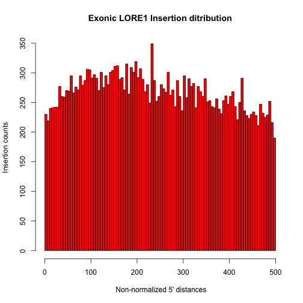
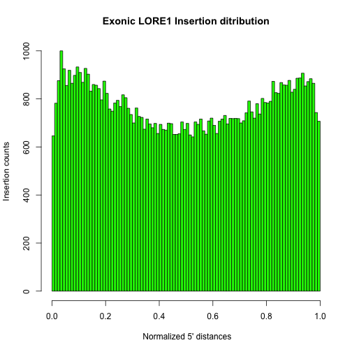

Calculating 5 prime distances for Lore1 instersions
====================


Step1. Make the GFF3 file with the longest isoforms
--------------------
cd /home/vgupta/01_genome_annotation/27_Lore1
python ~/script/python/21ar_findLongestIsoform_GFF3.py -i 20130802_Lj30.gff3 > 20130802_Lj30.LongestIsoform.gff3

Step2. Keep only protein coding genes
--------------------
awk '$2=="protein_coding"' 20130802_Lj30.LongestIsoform.gff3 > 20130802_Lj30.LongestIsoform.ProteinCoding.gff3

Step3. Make Lore1 distance table
--------------------
python ~/script/python/21as_calc5primeCdnaDistance.py -i 20130802_Lj30.LongestIsoform.gff3 -p Lore1_20130523.bed > Lore1_20130523.dist

Step4. Make the plot 
-------------------

```r
d <- read.table("~/Desktop//temp/Lore1_20130523.dist", header = TRUE)

# tiff(filename =
# '~/Desktop//03_Lotus_annotation/TranscriptLengthDist.tiff')
tdens = density(log10(d[, 8]))
xlab = "Log10 Length (bp)"
ylab = "Density"
main = "Length distribution"
plot(tdens, lwd = 5, col = "blue", ylab = ylab, xlab = xlab, main = main, cex.main = 2, 
    cex.lab = 2, cex.axis = 2, mar = c(0.5, 0.5, 0.5, 0.5))
```

 

```r
# dev.off()


hist(d[which(d[, 7] < 500), 7], breaks = 100, col = c("red"), xlab = " Non-normalized 5' distances", 
    ylab = "Insertion counts", main = "Exonic LORE1 Insertion ditribution")
```

 

```r


# tiff(filename =
# '~/Desktop//03_Lotus_annotation/Lore1_normalized_distribution.tiff')
hist(d[, 7]/d[, 8], breaks = 100, col = c("green"), xlab = " Normalized 5' distances", 
    ylab = "Insertion counts", main = "Exonic LORE1 Insertion ditribution")
```

 

```r

# dev.off()
```

